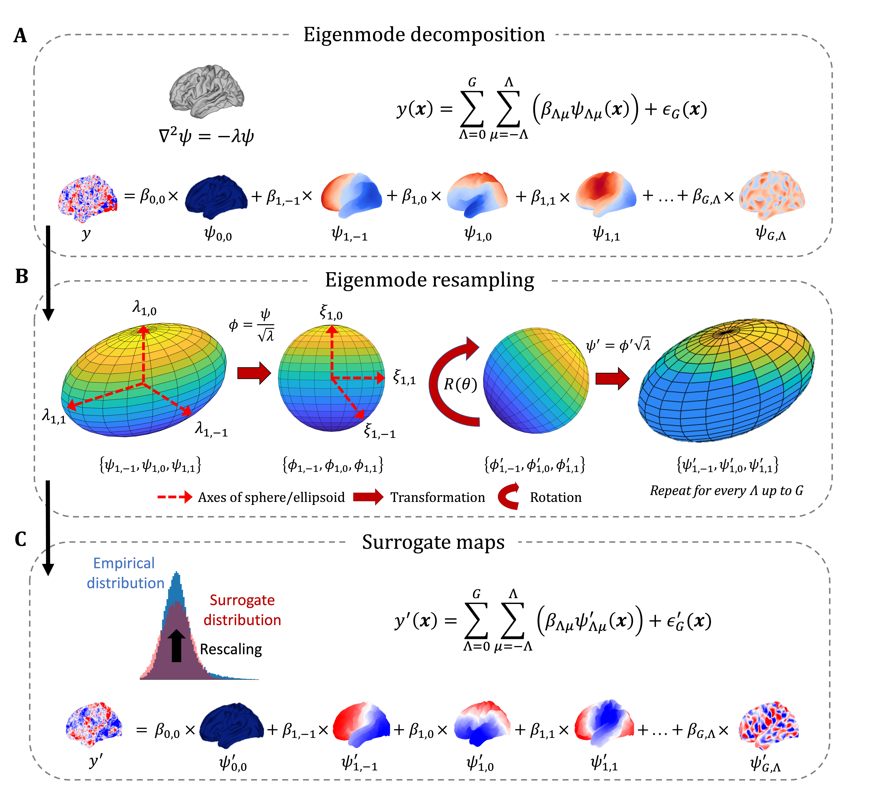

Code for "Generation of surrogate brain maps preserving spatial autocorrelation through random rotation of geometric eigenmodes"
--------------------------------------------------------------------------------------------------------------------------------

This repository
===============

contains the necessary code and tools to replicate the analyses in the manuscript

* Koussis, N. C., Pang, J. C., Jeganathan, J., Paton, B., Fornito, A., Robinson, P. A., Misic, B., & Breakspear, M. (2024). Generation of surrogate brain maps preserving spatial autocorrelation through random rotation of geometric eigenmodes. bioRxiv, 2024-02. `<https://doi.org/10.1101/2024.02.07.579070>`_

If you want to replicate some of the core analyses, check out the `scripts` folder, particularly the ones contained in the `cortical`, `subcortical`, and `simulation` folders.

Dependencies
============

In order to reproduce the simulated and subcortical analyses, you will need the following

* `gmsh <https://gmsh.info>`_
* `Connectome Workbench <https://www.humanconnectome.org/software/get-connectome-workbench>`_
* `Freesurfer (version 6.0.3 or higher) <https://surfer.nmr.mgh.harvard.edu/>`_

Easy setup and running
======================

Just want to start the analyses already?

.. code-block:: bash
    
    git clone https://github.com/SNG-Newy/eigenstrapping_analysis
    cd eigenstrapping_analysis
    conda env create -f environment.yml
    conda activate eigenstrapping_analysis
    make all

Make sure you've installed (and correctly sourced) the dependencies above. 

If you find yourself in the position to use a Docker image, try running our image that contains the packages that we used to run our analyses, and run it all there. You can find more info `here <./container/README.rst>`_

Running `make all` will take a couple of days on a HPC, probably a week or two on a laptop (untested). But most importantly, the Docker image will take care of all the dependencies for you (all you should have to do is wait - famous last words).

Re-running specific analyses
============================

If you just want to re-run specific analyses, you can pass different arguments to the `make` command. Each analysis can be re-run with `make <target>` where `<target>` is one of the following

* `cortical`: Run all cortical analyses, necessary for generating Figs. 1, 2, and 4.
* `subcortical`: Run all subcortical analyses, necessary for generating Fig. 5.
* `simulations`: Run all simulated analyses, necessary for generating Figs. 3 and 6.
* `plot_cortical`: Generate Figs. 1, 2, and 4.
* `plot_subcortical`: Generate Fig. 5.
* `plot_simulations`: Generate Figs. 3 and 6.
* `supp_cortical`: Run all supplementary cortical analyses and generate supplementary figures.
* `supp_simulations`: Run all supplementary simulated analyses and generate supplementary figures.

Each of these including `make all` can be sped up dramatically by having access to multiple cpu threads (although it's important to note that the computational time analysis in the supplementary is ALWAYS run with one thread even if there is more than one available).

